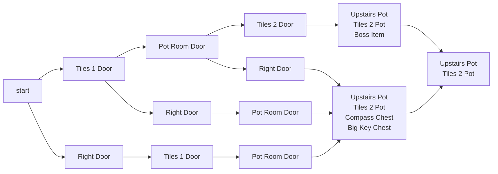
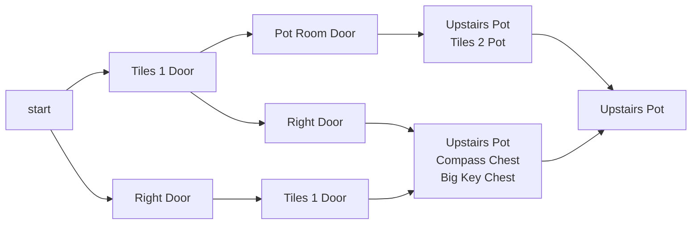
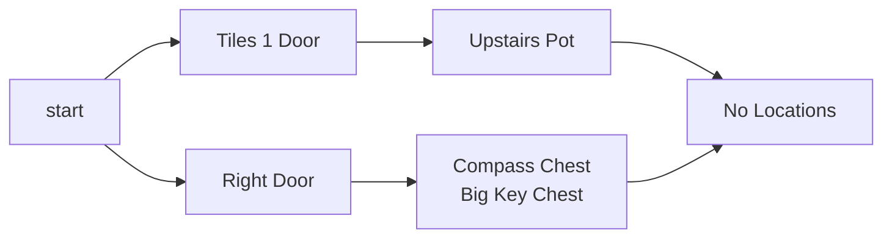

# Decision Tree (3 key)

```mermaid
graph LR
    start --> tiles1K1[Tiles 1 Door]
    tiles1K1 --> potroomK1[Pot Room Door]
    potroomK1 --> tiles2K1[Tiles 2 Door]
    tiles2K1 --> outcome1[Upstairs Pot<br/>Tiles 2 Pot<br/>Boss Item]
    potroomK1 --> rightdoorK3[Right Door]
    rightdoorK3 --> outcome2[Upstairs Pot<br/>Tiles 2 Pot<br/>Compass Chest<br/>Big Key Chest]
    tiles1K1 --> rightdoorK1[Right Door]
    rightdoorK1 --> potroomK3[Pot Room Door]
    potroomK3 --> outcome2
    start --> rightdoorK2[Right Door]
    rightdoorK2 --> tilesK2[Tiles 1 Door]
    tilesK2 --> potroomK4[Pot Room Door]
    potroomK4 --> outcome2
    outcome1 --> final[Upstairs Pot<br/>Tiles 2 Pot]
    outcome2 --> final
```

# Decision Tree (2 key)

```mermaid
graph LR
    start --> tiles1K1[Tiles 1 Door]
    tiles1K1 --> potroomK1[Pot Room Door]
    potroomK1 --> outcome1[Upstairs Pot<br/>Tiles 2 Pot]
    tiles1K1 --> rightdoorK1[Right Door]
    rightdoorK1 --> outcome2[Upstairs Pot<br/>Compass Chest<br/>Big Key Chest]
    start --> rightdoorK2[Right Door]
    rightdoorK2 --> tilesK2[Tiles 1 Door]
    tilesK2 --> outcome2
    outcome1 --> final[Upstairs Pot]
    outcome2 --> final
```

# Decision Tree (1 key)

```mermaid
graph LR
    start --> tiles1[Tiles 1 Door]
    tiles1 --> outcome1[Upstairs Pot]
    start --> rightdoor[Right Door]
    rightdoor --> outcome2[Compass Chest<br/>Big Key Chest]
    outcome1 --> final[No Locations]
    outcome2 --> final
```
