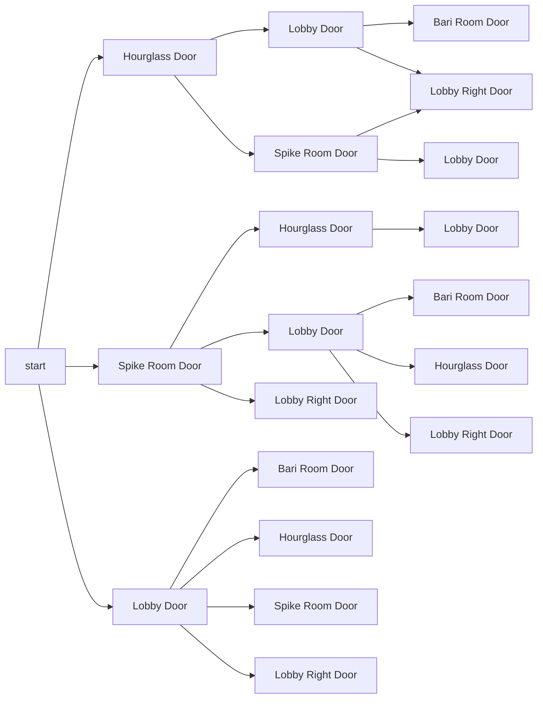
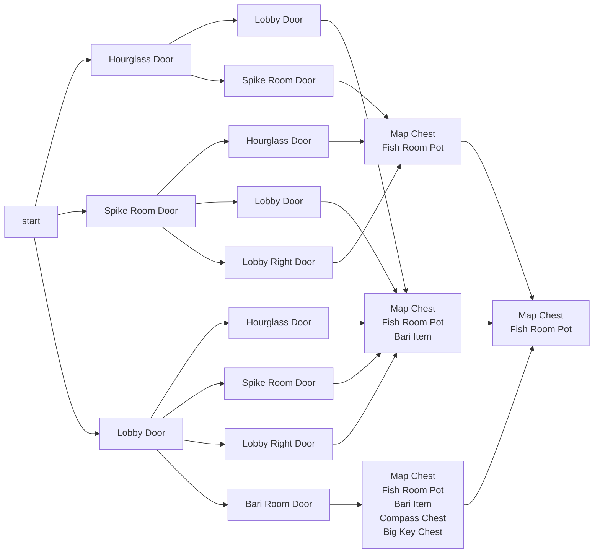
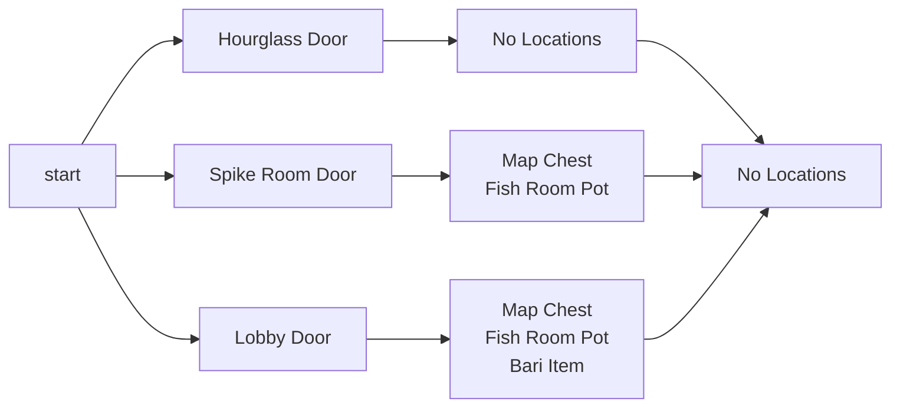

# Decision Tree (3 keys)

```mermaid
graph LR
    start --> hourglassdoorK1[Hourglass Door]
    hourglassdoorK1 --> lobbydoorK1[Lobby Door]
    lobbydoorK1 --> tilesdoorK1[Bari Room Door]
    lobbydoorK1 --> mapdoorK1[Lobby Right Door]
    hourglassdoorK1 --> spikeroomdoorK1[Spike Room Door]
    spikeroomdoorK1 --> lobbydoorK13[Lobby Door]
    spikeroomdoorK1 --> mapdoorK1[Lobby Right Door]
    start --> spikeroomdoorK2[Spike Room Door]
    spikeroomdoorK2 --> hourglassdoorK2[Hourglass Door]
    hourglassdoorK2 --> lobbydoorK23[Lobby Door]
    spikeroomdoorK2 --> lobbydoorK2[Lobby Door]
    lobbydoorK2 --> tilesdoorK2[Bari Room Door]
    lobbydoorK2 --> hourglassdoorK23[Hourglass Door]
    lobbydoorK2 --> mapdoorK23[Lobby Right Door]
    spikeroomdoorK2 --> mapdoorK2[Lobby Right Door]
    start --> lobbydoorK3[Lobby Door]
    lobbydoorK3 --> tilesdoorK3[Bari Room Door]
    lobbydoorK3 --> hourglassdoorK3[Hourglass Door]
    lobbydoorK3 --> spikeroomdoorK3[Spike Room Door]
    lobbydoorK3 --> mapdoorK3[Lobby Right Door]
```

# Decision Tree (2 keys)

```mermaid
graph LR
    start --> hourglassdoorK1[Hourglass Door]
    hourglassdoorK1 --> lobbydoorK1[Lobby Door]
    lobbydoorK1 --> outcome1[Map Chest<br/>Fish Room Pot<br/>Bari Item]
    hourglassdoorK1 --> spikeroomdoorK1[Spike Room Door]
    spikeroomdoorK1 --> outcome2[Map Chest<br/>Fish Room Pot]
    start --> spikeroomdoorK2[Spike Room Door]
    spikeroomdoorK2 --> hourglassdoorK2[Hourglass Door]
    hourglassdoorK2 --> outcome2
    spikeroomdoorK2 --> lobbydoorK2[Lobby Door]
    lobbydoorK2 --> outcome1
    spikeroomdoorK2 --> mapdoorK2[Lobby Right Door]
    mapdoorK2 --> outcome2
    start --> lobbydoorK3[Lobby Door]
    lobbydoorK3 --> hourglassdoorK3[Hourglass Door]
    hourglassdoorK3 --> outcome1
    lobbydoorK3 --> spikeroomdoorK3[Spike Room Door]
    spikeroomdoorK3 --> outcome1
    lobbydoorK3 --> mapdoorK3[Lobby Right Door]
    mapdoorK3 --> outcome1
    lobbydoorK3 --> tilesdoorK3[Bari Room Door]
    tilesdoorK3 --> outcome3[Map Chest<br/>Fish Room Pot<br/>Bari Item<br/>Compass Chest<br/>Big Key Chest]
    outcome1 --> final[Map Chest<br/>Fish Room Pot]
    outcome2 --> final
    outcome3 --> final
```

# Decision Tree (1 key)

```mermaid
graph LR
    start --> hourglassdoorK1[Hourglass Door]
    hourglassdoorK1 --> outcome1[No Locations]
    start --> spikeroomdoorK2[Spike Room Door]
    spikeroomdoorK2 --> outcome2[Map Chest<br/>Fish Room Pot]
    start --> lobbydoorK3[Lobby Door]
    lobbydoorK3 --> outcome3[Map Chest<br/>Fish Room Pot<br/>Bari Item]
    outcome1 --> final[No Locations]
    outcome2 --> final
    outcome3 --> final
```

# Misery Mire

```mermaid
graph LR
    start --> bigchest[Big Chest]:::itemLocation
    start --> boss[Boss Item]:::itemLocation
    start --> lobbydoor[Lobby Door]
    start --> spikechest[Spike Chest]:::itemLocation
    lobbydoor --> tilesdoor[Bari Room Door]
    spikeroomdoor --> basementdoor
    tilesdoor --> basementdoor[Useless Door]
    tilesdoor --> compasschest[Compass Chest]:::itemLocation
    tilesdoor --> bigkeychest[Big Key Chest]:::itemLocation
    start --> hourglassdoor[Hourglass Door]
    start --> spikeroomdoor[Spike Room Door]
    spikeroomdoor --> mapdoor[Lobby Right Door]
    spikeroomdoor --> lobbychest[Lobby Chest]:::itemLocation
    spikeroomdoor --> mapchest[Map Chest]:::itemLocation
    lobbydoor --> mapdoor
    lobbydoor --> lobbychest
    lobbydoor --> mapchest
    classDef itemLocation fill:#111111,stroke:#333,stroke-width:4px;
```
